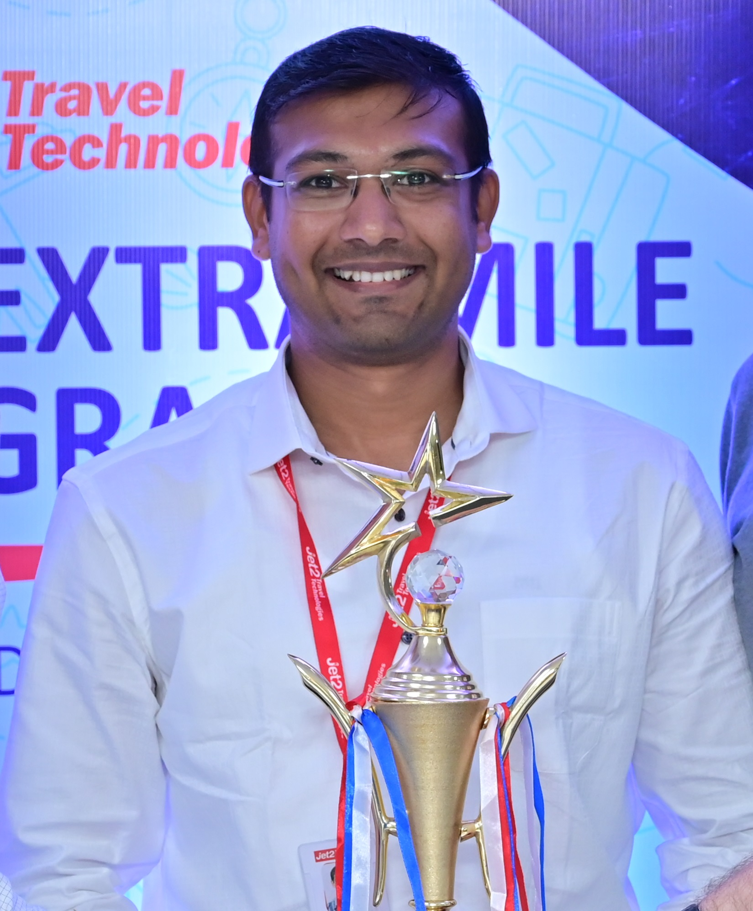

# PRATIK SHIRBHATE

## Contact Information
- pratikshirbhate@gmail.com
- Phone: 7588809138
- [LinkedIn Profile](https://www.linkedin.com/in/pratik-shirbhate/)
- [GitHub Profile](https://github.com/PRATIKSHIRBHATE)

## Summary
Technical Lead Data Scientist with over 10 years of experience in designing, developing, and productionizing solutions using Data Science-Big Data technologies, which have driven significant revenue growth and operational efficiency

## Professional Experience:
### Jet2 Travel Tech, Pune
- Technical Lead Data Scientist, Jul 2022 - Till Date
- Description: Lead a team of machine learning engineers and data scientists to identify and assess the impact of business initiatives, develop, deploy, and maintain a production system solution, along with cloud infrastructure, that brings value to the organization and aligns with the organization's growth strategy

- Senior Machine Learning Engineer, Apr 2022 - Aug 2022
- Description: Lead a team of machine learning engineers to assess the technical feasibility of the developed data science solution and deploy, maintain, and provide production support for the production system solution, along with cloud infrastructure.

- Senior Data Scientist, Nov 2020 - Apr 2022
- Description: Lead a team of data scientists to identify and assess the impact of business initiatives in terms of value opportunity, and design, develop, and test the data science solution

### Evolent Health, Pune
- Senior Data Scientist, Jul 2020 - Oct 2020
- Description: Collaborate with the US data science team and lead the India data science team in designing, developing, testing, and deploying the data science solution.

- Data Scientist, Oct 2018 - Jun 2020
- Description: Collaborate with the US data science team to design, develop, and test the components of the data science solution.
### Cognizant Technology Solutions, Pune
- Associate, Nov 2015 - Sep 2018
- Description: Collaborate with the on-site lead data scientist to conduct and present data analysis, and construct a proof of concept for a data science solution
### MIT COE, Pune
- Assistant Professor,  July 2015 - Oct 2015

## Education
| Degree | Percentage/CGPA | University/Board | Year |
|--------|-----------------|------------------|------|
| M.Tech (Mech Eng) | 8.76/10 | IIT Gandhinagar | 2013-15 |
| B.E (Mechanical Eng) | 85% (4th Merit, College Topper) | SGBAU, MH | 2009-13 |
| HSC | 90% | Board of Intermediate Education, Hyderabad | 2007-09 |
| SSC | 84.76% | MH State Board | 2007 |

## Acomplishments / Certifications
- Speaker at Analytics Vidhya Datahack Summit 2022
- Google Cloud Professional Machine Learning Engineer - Coursera
- AI - Medical Specialization, Deep-learning.ai
- Machine Learning- Udemy
- Kubernetes- Simplilearn
- Algorithms & DS - Coursera

## Skills
| **NLP / Machine Learning** | **Programming / Data Analysis** | **Cloud Platforms**               | **Big Data / Orchestration** |
|--------------------------|--------------------------------|------------------------------------|------------------------------|
| LLM                      | Python                         | GCP (Google Cloud Platform)        | DataIKU                      |
| Deep Learning-Tensorflow | Snowflake-SQL                  | - GKE & Compute Engine             | Terraform                    |
| Machine Learning-sklearn | R                              | - Google Cloud Storage             | Apache Spark                 |
| H2O - AutoML             |                                | - App Engine & Cloud Function      | Docker                       |
|                          |                                | - AWS (Amazon Web Services)        | Hadoop/HDFS                  |
|                          |                                | - AWS Lambda, EC2 & S3             | Hive/Pig/Sqoop/Flume         |
| **Web Dev / Version Control** | **Data Viz / Analysis**   | **NoSQL Database**             | **Agile**                    |
| Heroku                   | Tableau                        | MongoDB                            | AzureDevOps(Planning,standup,retro) |
| Flask                    | Excel                          |                                    | Confluence                   |
| GIT                      | PowerPoint                     |                                    | Jira                         |

## Projects
### Hotel Price Elasticity - Surge Detection Based Revenue Optimization Project
- Built and deployed a real-time Booking surge detection at Hotel Occupancy Date level and optimized the Hotel Margin on Dataiku platform with GKE as the backend.
- Estimated an increase in revenue by 5M GBP for 2024 Bookings for 20% properties

### Flight Price Elasticity - One Way Supplement - Airline Revenue Project
- Built and deployed a real-time dynamic One Way Booking Airline pricing model on the Dataiku platform with GKE as the backend.
- Estimated an increase in revenue by 3M GBP for 2024 Bookings.

### Package Only Flights - Airline Revenue Project
- Ensembled Supervised, Unsupervised, and Pulp Optimization models to recommend package-only flights.
- Monthly batch prediction to run on Dataiku+GKE and developed a Tableau Dashboard for Business Analysis.
- Estimated an increase in Holiday Mix by 30% for identified Package only Flights.

### Customer Lifetime Value (In Development):
- Ensembled KNN, K-Means, and RFM models to suggest potential high-value customers for targeted marketing.

### DRG Recoup:
- Developed and deployed ensembled statistical, supervised (XGBoost), unsupervised (GMM, IsolationForest, K-Prototype) models for upcoding suspect and fraud detection.
- Estimated a reduction in upcoding fraud by 1%, saving approximately 3M USD every year.

### Auto Intake:
- Built and deployed an automated OCR pipeline using computer vision (openCV), image segmentation & preprocessing (Pillow), Tesseract, and NLP for Prior Authorization scanned fax images and feed the information to databases.
- Estimated a reduction in manual effort by 40%, saving approximately 4M USD every year.

### Provider Matching:
- Created a real-time machine learning API service using Serverless Framework, AWS Lambda, API gateway, and TensorFlow/Python, which provides a response in less than 300 ms, to improve the auto adjudication rate of the claim processing system.
- Created batch jobs automation using Apache Airflow to pull the data from SQL Servers and update the resource files on AWS S3 buckets required for API service.
- Estimated savings of 100k USD per year for a 5% increase in the auto adjudication rate.

### Readmission Prediction:
- Built and automated machine learning pipeline for readmission prediction models using Apache Airflow, Scikit-learn, Keras (Python3.6), and MongoDB.
- Created a real-time service using AWS Lambda and pertained ML model and exposed the API to the predefined ETL process.
- Estimated a reduction in 3% fraudulent readmission cases.

### Medicaid Retention Model:
- Built a robust machine learning (Logistic Regression, Random Forest, and XG-Boost) and survival model to predict the churn rate of the Medicaid population.
- Generated population retention reports based on the ML models and communicated with the business.

### Hospital Visit Classification:
- Built a machine learning model to predict the place of service based on the claim attributes to optimize the ED utilization.
- Created a Flask API and deployed the ML model on the Heroku platform as a service.
- Monitored and maintained the machine learning model and retrained periodically.

### Patient Risk Score Prediction POC:
- Built a model to predict risk scores to help the actuarial team for pricing and planning.
- Tuned hyperparameters using SKlearn's Grid Search and evaluated the performance of machine learning models using K-Fold cross-validation.
- Created the web app using the Flask Framework and deployed it on Heroku.