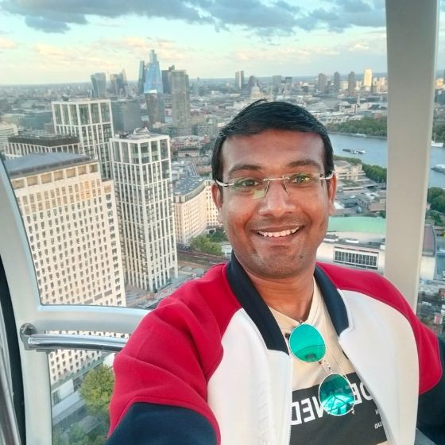

# Pratik Shirbhate

**Lead AI/ML Platform Architect | MLOps & ML Platform Engineering | AWS, SageMaker, Terraform | Enabling Scalable Production ML Systems**

📍 Pune, Maharashtra, India

---

## Contact

- Email: pratikshirbhate@gmail.com
- Phone: +91 7588809138
- [LinkedIn](https://www.linkedin.com/in/pratik-shirbhate/)
- [GitHub](https://github.com/PRATIKSHIRBHATE)

---

## Summary

I turn fragmented ML experiments into production-grade AI platforms — and I've spent 10+ years doing exactly that across healthcare, travel, and enterprise.

At Jet2, I lead ML Platform Engineering for a 50+ person data science organisation. In the last three years:

- Migrated the entire DS org from Dataiku to a cloud-native MLOps platform on AWS SageMaker — from architecture to go-live
- Cut cloud infrastructure costs by 50% (~£150K/year) through compute rightsizing, lifecycle policies, and VPC optimisation
- Productionised 20+ ML models across Retail Pricing, Marketing Attribution, Fuel Forecasting, and Revenue Risk
- Enabled self-service ML infrastructure for 50+ data scientists and ML engineers, reducing time-to-production significantly
- Built CI/CD, model governance, and observability frameworks from scratch — now the org standard

Before Jet2, I built predictive models in healthcare analytics at Evolent Health and developed my data engineering foundation at Cognizant.

**What I'm best at:** MLOps & ML Platform Architecture · AWS / SageMaker / Terraform · CI/CD for ML · Model Governance & Monitoring · Cost-Optimised AI Infrastructure · Cross-functional Engineering Leadership

I'm at my best when there's a messy, large-scale platform problem to solve — turning experimental chaos into reliable, industrialised AI.

Open to Principal / Staff / Lead roles in ML Platform Engineering, AI Infrastructure Architecture, or Enterprise AI Transformation. Based in Pune; open to remote or hybrid UK/India roles.

---

## Professional Experience

### Jet2 Travel Technologies Pvt Ltd. (5 years 7 months)

**Machine Learning Platform Lead** | April 2026 – Present | Pune

Led end-to-end migration of a 50+ member Data Science org from Dataiku to Amazon SageMaker, delivering a production-grade, multi-environment MLOps platform on AWS.

- Designed and architected cloud-native ML platform (SageMaker, Snowflake, Terraform, Azure DevOps) supporting 20+ ML projects across dev, test, and production
- Cut cloud infrastructure costs by 50%+ (~£150K/year) via compute rightsizing, lifecycle policies, and VPC optimization
- Established AWS account structure, IAM governance, and VPC architecture enabling secure self-service for 50+ users
- Standardized CI/CD pipelines, release governance, and Docker/ECR environments — increasing deployment frequency
- Built cost monitoring frameworks giving leadership first-ever visibility into per-project AWS spend
- Led incident management practices (PagerDuty, RCA) improving platform reliability
- Managed and mentored 5–8 ML engineers across UK and India, driving upskilling for 50+ engineers

**Technical Lead – Data Science & Machine Learning** | July 2022 – April 2026 | Pune

Led MLOps and CI/CD engineering, productionizing 20+ ML models across Retail Dynamic Pricing, Marketing Attribution, Fuel Forecasting, and Revenue Trading Risk.

- Founder of MLE Team; led 6–8 ML engineers, owning model productionization from experimentation handoff to live deployment
- Supported 40+ data scientists across business teams, establishing repeatable deployment patterns
- Built CI/CD pipelines for model training, validation, and deployment — standardizing release processes
- Established MLOps best practices: model monitoring, versioning, and lifecycle management
- Laid foundational ML infrastructure that directly evolved into the org's full-scale ML platform

**Senior Machine Learning Engineer** | April 2022 – August 2022 | Pune

- Built MLE Team from scratch; deployed scalable machine learning pipelines, transitioning models from research to production
- Developed automated workflows for model training, evaluation, and deployment using cloud-based infrastructure
- Collaborated closely with data scientists to productionize models and ensure performance, scalability, and reliability
- Implemented monitoring and logging mechanisms to track model performance in production
- Contributed to early MLOps practices, improving repeatability and maintainability of ML systems

**Senior Data Scientist** | November 2020 – August 2022 | Pune

- Developed and deployed machine learning models solving business problems across the Airline domain
- Performed data analysis, feature engineering, and model evaluation to improve predictive performance
- Collaborated with stakeholders to translate business requirements into data-driven solutions
- Delivered actionable insights and predictive models to support decision-making

---

### Evolent Health (2 years 2 months)

**Senior Data Scientist** | July 2020 – November 2020 | Pune

- Collaborated with US data science team and led India data science team
- Designed, developed, tested, and deployed data science solutions in healthcare analytics

**Data Scientist** | October 2018 – June 2020 | Pune

- Collaborated with US data science team to design, develop, and test components of data science solutions
- Built and deployed ML models for healthcare fraud detection, patient risk scoring, and claims processing

---

### Cognizant (2 years 11 months)

**Data Science and Big Data Associate** | November 2017 – September 2018 | Pune

**Data Science Associate** | November 2015 – November 2017 | Coimbatore, Tamil Nadu

- Collaborated with on-site lead data scientist to conduct data analysis and build proof of concepts for data science solutions

---

### MAEER'S MIT College of Engineering

**Assistant Professor** | July 2015 – November 2015 | Pune

- Taught Engineering Graphics, Fluid Mechanics, and Heat Transfer

---

## Technical Skills

MLOps & ML Platform Architecture · AWS SageMaker · Terraform · LLM Platform Engineering & GenAI Infrastructure · Infrastructure as Code · Snowflake · CI/CD for ML · Model Governance & Monitoring · Docker · Azure DevOps · Python · SQL · Apache Airflow · Apache Spark · GCP (GKE, Compute Engine) · Machine Learning (sklearn, H2O AutoML) · Deep Learning (TensorFlow) · Predictive Modeling · Feature Engineering · Tableau · MongoDB · Git · R

---

## Key Projects & Business Impact

### Jet2 – ML Platform & Infrastructure

| Project | Impact |
|---------|--------|
| Dataiku → AWS SageMaker Platform Migration | Led end-to-end migration of 20+ DS initiatives to a cloud-native MLOps platform (SageMaker, Snowflake, Terraform, Azure DevOps). Enabled self-service for 50+ users. **£150K/year cost savings** (50% reduction) via compute rightsizing, lifecycle policies & VPC optimization. Replaced legacy tooling with production-grade CI/CD, model governance, and observability — now the org standard. |
| MLE Team & MLOps Practice (Founded) | Built the ML Engineering team from scratch (6–8 engineers). Productionized 20+ models across Pricing, Marketing, Fuel & Risk. Established repeatable deployment patterns for 40+ data scientists, standardized CI/CD pipelines, model monitoring, versioning & lifecycle management. **Reduced time-to-production significantly** and laid the foundation for the full-scale ML platform. |

### Jet2 – Travel & Airline Revenue

| Project | Impact |
|---------|--------|
| Hotel Price Elasticity – Surge Detection | Real-time booking surge detection at hotel occupancy date level. **+5M GBP revenue** (2024, 20% properties) |
| Flight Price Elasticity – One Way Supplement | Real-time dynamic airline pricing model on Dataiku + GKE. **+3M GBP revenue** (2024) |
| Package Only Flights | Ensembled supervised, unsupervised & Pulp optimization models. **+30% Holiday Mix** for identified flights |
| Customer Lifetime Value | KNN, K-Means, and RFM ensemble for targeted marketing (in development) |

### Evolent Health – Healthcare Analytics

| Project | Impact |
|---------|--------|
| DRG Recoup (Fraud Detection) | Ensembled XGBoost, GMM, IsolationForest, K-Prototype. **~3M USD annual savings** (1% fraud reduction) |
| Auto Intake (OCR Pipeline) | OpenCV, Tesseract, NLP for Prior Authorization fax processing. **~4M USD annual savings** (40% manual effort reduction) |
| Provider Matching | Real-time ML API (AWS Lambda, TensorFlow) <300ms response. **~100K USD/year savings** (5% auto-adjudication improvement) |
| Readmission Prediction | Automated ML pipeline (Airflow, sklearn, Keras, MongoDB). **3% fraudulent readmission reduction** |
| Medicaid Retention Model | Logistic Regression, Random Forest, XGBoost + survival model for churn prediction |
| Hospital Visit Classification | ML model for place-of-service prediction to optimize ED utilization. Deployed on Heroku via Flask |
| Patient Risk Score Prediction | Risk scoring model for actuarial pricing & planning. Flask web app on Heroku |

---

## Education

| Degree | Institution | Year | Score |
|--------|-------------|------|-------|
| M.Tech (Mechanical Engineering – Thermo-Fluids) | IIT Gandhinagar | 2013–2015 | 8.76/10 |
| B.E. (Mechanical Engineering) | SGBAU, Maharashtra | 2009–2013 | 85% (4th Merit, College Topper) |
| HSC | Board of Intermediate Education, Hyderabad | 2007–2009 | 90% |
| SSC | Maharashtra State Board | 2007 | 84.76% |

---

## Certifications & Accomplishments

- AWS Certified Machine Learning Engineer – Associate
- Speaker at Analytics Vidhya Datahack Summit 2022
- Google Cloud Professional Machine Learning Engineer
- AI for Medicine Specialization (deeplearning.ai)
- AI for Medical Treatment
- Machine Learning (Udemy)
- Kubernetes (Simplilearn)
- Algorithms & Data Structures (Coursera)
- Programming, Data Structures and Algorithms Using Python
- Divide and Conquer, Sorting and Searching, and Randomized Algorithms
- Participation Certificate at Big Data Analytics Conference
